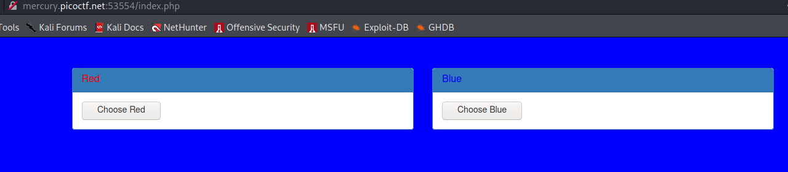

Get ahead 

 

Description 

Find the flag being held on this server to get ahead of the competition http://mercury.picoctf.net:53554/ 

 
Visit the URL 

Let's look at the HTML Code  

.png)

You can see there are two different methods used. "GET" and "POST" so the hint is probably referring to a third method and we can see "HEAD" popping out in the title. Let's try a "HEAD" request

.png)

Using Burpsuite, 

.png)
 

Intercept the request and forward the request to repeater 

Change the GET HTTP method to HEAD  

.png)